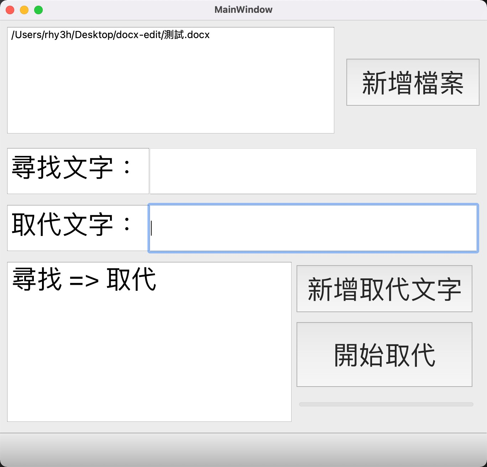

# Docx Edit

[](https://wakatime.com/badge/github/rhy3h/docx-edit)

This is a practice side project for Gui & Docx

## PyQt5 tranport to python
```shell
pyuic5 -x myUI.ui -o myUI.py
```
## Demo Image

